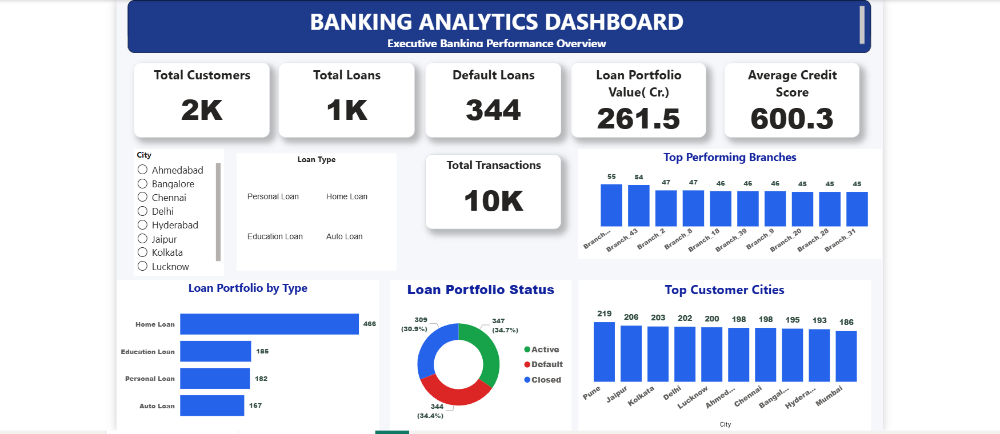
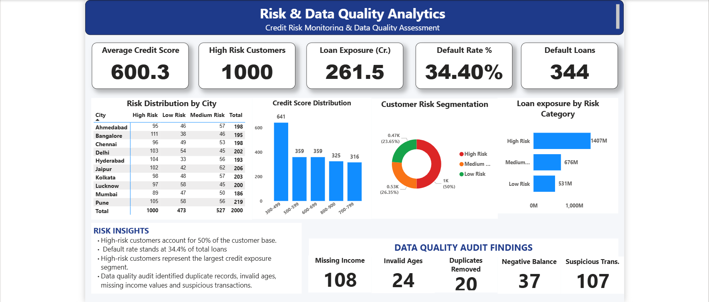

# Banking Analytics Project — MySQL & Power BI

**Author:** Yash Mishra  
**Tools:** MySQL 8.0 | Power BI  
**Domain:** Banking & Financial Services  
**Type:** End-to-End Analytics Project (Data Modelling → Cleaning → Analysis → Dashboard)

---

## Project Objective

Developed an end-to-end banking analytics solution to analyze customer demographics, loan portfolio performance, branch efficiency, credit risk segmentation, and data quality across a synthetic banking dataset of 2,000 customers across 10 Indian cities and 50 branches.

---

## Dataset Overview

| Table | Records | Description |
|---|---|---|
| Customers | 2,000 | Demographics, income, city, branch mapping |
| Accounts | — | Account type and balance per customer |
| Loans | 1,000 | Loan type, amount, and repayment status |
| Transactions | 10,000 | Transaction type and amount per account |
| CreditScores | 2,000 | Credit score per customer |
| Branches | 50 | Branch name, city, and region |

> Synthetic dataset generated for analytics practice purposes.

---

## Project Structure

```
Banking-Analytics-MySQL-PowerBI/
│
├── Bankinganalytics.sql               ← Complete SQL file (all 5 sections)
├── Bankinganalytics.pbix              ← Power BI Dashboard file (open in Power BI Desktop)
├── dashboard_executive.png            ← Power BI Page 1: Executive Overview
├── dashboard_risk.png                 ← Power BI Page 2: Risk & Data Quality
└── README.md                          ← This file
```

---

## SQL Workflow — 5 Sections

### Section 1 — Database & Schema Design
Designed a normalized relational schema with 6 tables covering all key banking entities: customers, accounts, loans, transactions, credit scores, and branches. Each table was created with appropriate data types (`INT`, `VARCHAR`, `DECIMAL`) to reflect real-world banking data structures.

### Section 2 — Data Quality Audit
Ran 5 audit checks on raw data before any cleaning to identify issues:

| Issue Found | Count |
|---|---|
| Missing / zero income values | 108 |
| Duplicate customer records | 20 |
| Accounts with negative balances | 37 |
| Suspicious high-value transactions (₹9.5L+) | 107 |
| Customers with invalid ages (minors or out-of-range) | 24 |

### Section 3 — Data Cleaning
Created 5 dedicated clean tables using `CREATE TABLE AS SELECT DISTINCT *` to remove duplicate records across all entities before analysis.

### Section 4 — Data Validation
Verified total record counts vs. unique ID counts post-cleaning across all 5 tables to confirm successful deduplication and data integrity.

### Section 5 — Business Analysis
10+ queries covering loan portfolio analysis, branch performance, income segmentation, credit risk profiling, and customer ranking — using a combination of basic to intermediate SQL concepts.

---

## SQL Concepts Demonstrated

| Concept | Where Used |
|---|---|
| DDL — CREATE TABLE, CREATE DATABASE | Section 1 |
| Aggregate Functions — COUNT, AVG, SUM, ROUND | Sections 2 & 5 |
| GROUP BY, HAVING, ORDER BY | Sections 2 & 5 |
| INNER JOIN, LEFT JOIN across multiple tables | Section 5 |
| CASE WHEN — risk segmentation & age categorization | Sections 2 & 5 |
| Window Function — ROW_NUMBER() OVER() | Top 5 Highest Income Customers |
| Window Function — RANK() OVER() | Branch Performance Ranking |
| CTE — WITH clause (Query 1) | RankedCustomers — income ranking |
| CTE — WITH clause (Query 2) | BranchRiskProfile — 4-table risk join |
| CREATE VIEW | vw_Customer_Risk_Summary — dashboard layer |
| Subqueries | Data validation checks |

---

## Key Business Findings

- **34.4% loan default rate** — 344 out of 1,000 loans currently in default status, signalling significant portfolio credit risk
- **50% of customers are High Risk** (credit score below 600) — the single largest customer segment by risk tier
- **High Risk segment carries ₹1,407M in loan exposure** vs ₹676M (Medium Risk) and ₹531M (Low Risk) — concentration risk is heavily skewed toward the riskiest borrowers
- **Home Loans dominate the portfolio** at 466 out of 1,000 total loans, followed by Education (185), Personal (182), and Auto (167)
- **Average portfolio credit score is 600.3** — sitting exactly at the borderline between Medium and High Risk, indicating the overall portfolio is under stress
- **Pune leads customer acquisition** with 219 customers, followed by Jaipur (206) and Kolkata (203) across 10 cities
- **Branch_43 is the top performing branch** with 55 customers; most branches cluster between 45–55 customers indicating relatively even distribution

---

## Power BI Dashboard

### Page 1 — Executive Banking Performance Overview



**KPI Cards:**
- Total Customers: **2K**
- Total Loans: **1K**
- Default Loans: **344**
- Loan Portfolio Value: **₹261.5 Cr**
- Average Credit Score: **600.3**
- Total Transactions: **10K**

**Visuals:**
- Loan Portfolio by Type — horizontal bar chart (Home, Education, Personal, Auto)
- Loan Portfolio Status — donut chart (Active 34.7% | Closed 30.9% | Default 34.4%)
- Top Performing Branches — bar chart (top 10 branches by customer count)
- Top Customer Cities — bar chart (top 10 cities by customer volume)
- City Slicer — interactive filter for all visuals by city

---

### Page 2 — Risk & Data Quality Analytics



**KPI Cards:**
- Average Credit Score: **600.3**
- High Risk Customers: **1,000**
- Loan Exposure: **₹261.5 Cr**
- Default Rate: **34.40%**
- Default Loans: **344**

**Visuals:**
- Risk Distribution by City — matrix table (High / Medium / Low Risk per city)
- Credit Score Distribution — histogram by score band (300–799)
- Customer Risk Segmentation — donut chart (High 50% | Low 26.35% | Medium 23.65%)
- Loan Exposure by Risk Category — bar chart (High ₹1,407M | Medium ₹676M | Low ₹531M)
- Data Quality Audit Findings — KPI cards (Missing Income: 108 | Invalid Ages: 24 | Duplicates: 20 | Negative Balance: 37 | Suspicious Transactions: 107)

---

## How to Run the SQL File

1. Install **MySQL 8.0+** and open **MySQL Workbench**
2. Create a new connection to your local MySQL server
3. Open `Bankinganalyticsdeliverables.sql` via **File → Open SQL Script**
4. Run **Section 1 first** to create the database and all tables
5. Import your dataset into the raw tables
6. Run **Sections 2 to 5** sequentially — place cursor inside each query block and press **Ctrl+Enter** to run one statement at a time

> **Note:** CTEs (`WITH` clause) and window functions (`RANK`, `ROW_NUMBER`) require **MySQL 8.0 or higher**. Running on MySQL 5.x will throw a syntax error on those specific queries.

---

## Tools & Skills Used

`MySQL 8.0` &nbsp; `Power BI` &nbsp; `Data Modelling` &nbsp; `Data Cleaning` &nbsp; `Data Validation` &nbsp; `Credit Risk Analysis` &nbsp; `Loan Portfolio Analysis` &nbsp; `Window Functions` &nbsp; `CTEs` &nbsp; `CREATE VIEW` &nbsp; `Business Intelligence` &nbsp; `Banking Domain`

---

## Author

**Yash Mishra**  
B.Voc (BFSI) — Ramanujan College, University of Delhi  
[LinkedIn](https://linkedin.com/in/yashsimplifyingideas) | [GitHub](https://github.com/Yashm6643)
